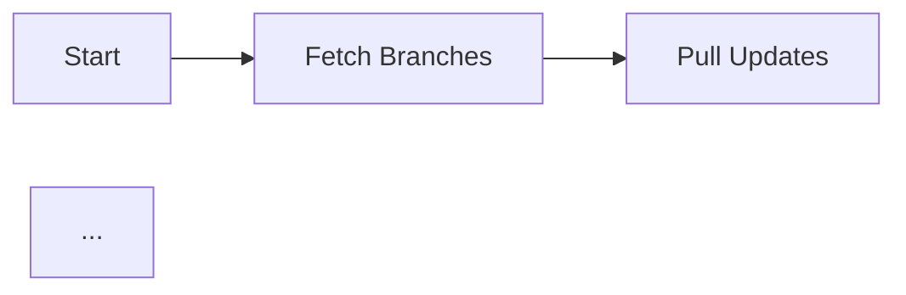

# 🚀 Nava Ops v2.0 - Revolutionary Features

## The Reporting Revolution

Nava Ops v2.0 transforms Git orchestration with next-generation reporting capabilities that go far beyond basic operations. This document details the revolutionary features that make Nava Ops the most powerful Git orchestration and analytics platform available.

---

## 📊 **Advanced Analytics Engine**

### Branch Health Scoring
Every branch gets a comprehensive health score (0-100) based on multiple factors:

- **Divergence Score** (30% weight): How far ahead/behind the base branch
- **Freshness Score** (25% weight): Last commit date and activity
- **Conflict Risk** (25% weight): Predicted merge conflict probability
- **Activity Level** (20% weight): Recent development activity

```python
from src import AdvancedAnalyticsEngine

engine = AdvancedAnalyticsEngine()
health = engine.calculate_branch_health(
    branch_name="feature/new-ui",
    commits_ahead=15,
    commits_behind=5,
    last_commit_date="2024-01-15T10:30:00Z"
)

print(f"Health Score: {health.health_score}/100")
print(f"Recommendation: {health.merge_recommendation}")
```

**Health Scores:**
- **80-100**: 🟢 Excellent - Safe to merge
- **60-79**: 🟡 Good - Review recommended
- **40-59**: 🟠 At Risk - Caution required
- **0-39**: 🔴 Critical - High risk

### Repository Health Dashboards
Get a bird's-eye view of entire repository health:

- Overall health score
- Healthy vs. at-risk vs. critical branches
- Stale branch detection (>90 days)
- Average divergence metrics
- Actionable recommendations

### Conflict Prediction Heatmap
AI-powered conflict probability matrix between any two branches:

```python
heatmap = engine.generate_conflict_heatmap(
    branches=["main", "develop", "feature-a", "feature-b"],
    branch_comparisons=comparison_data
)

# Returns probability matrix (0.0-1.0)
# High-risk pairs identified automatically
```

### Merge Success Rate Tracking
Historical analysis of merge operations:

- Total vs. successful vs. failed merges
- Success rate by merge strategy (merge/rebase/squash)
- Common failure patterns
- Performance by operation type

### Divergence Metrics
Detailed analysis of branch divergence:

- Commits ahead/behind
- File changes, insertions, deletions
- Divergence ratio and similarity score
- Merge complexity estimation (simple/moderate/complex)
- Estimated conflict count

---

## 📝 **Enhanced Export Formats**

### 1. CSV Export
Perfect for Excel and Pandas analysis:

```python
from src import EnhancedExportFormats

exporter = EnhancedExportFormats()
filepath = exporter.export_csv(report)
# Opens in Excel, imports into Pandas
```

**Includes:**
- Summary statistics table
- Branch operations with timestamps
- Error log
- Success/failure indicators

### 2. XML Export
Enterprise system integration:

```python
filepath = exporter.export_xml(report)
```

**Features:**
- Hierarchical structure
- Full metadata
- Easy parsing with standard XML libraries
- Schema-compatible

### 3. Prometheus Metrics
Time-series monitoring integration:

```python
filepath = exporter.export_prometheus_metrics(report)
# Scrape with Prometheus
```

**Metrics Exported:**
- `nava_ops_total_operations` (counter)
- `nava_ops_successful_operations` (counter)
- `nava_ops_failed_operations` (counter)
- `nava_ops_success_rate` (gauge)
- `nava_ops_duration_seconds` (gauge)
- `nava_ops_repository_branches{repository="..."}` (gauge)
- `nava_ops_operation_success{operation="...",result="..."}` (counter)

**Use Case:** Monitor Git operations in your observability stack alongside application metrics.

### 4. Grafana Dashboard JSON
Ready-to-import Grafana dashboards:

```python
filepath = exporter.export_grafana_json(report, analytics)
# Import directly into Grafana
```

**Dashboard Panels:**
- Success rate gauge with thresholds
- Total operations stat
- Operations by type pie chart
- Branch status table

### 5. Enhanced Markdown with Mermaid
Beautiful documentation with flow diagrams:

```python
filepath = exporter.export_enhanced_markdown(report, analytics)
```

**Features:**
- Executive summary with badges
- Mermaid flow diagrams
- Health score tables
- Key insights and action items
- Emoji indicators for visual scanning

**Example Output:**
```markdown
## 🎯 Executive Summary

**Overall Status:** 🟢 Excellent (95.5% success rate)

| Metric | Value |
|--------|-------|
| Total Operations | 42 |
| Successful | ✅ 40 |
| Failed | ❌ 2 |

## 🔄 Operation Flow


```

---

## 🎨 **Interactive HTML Reports with Chart.js**

### Beautiful Visualizations
Revolutionary HTML reports with embedded Chart.js charts:

```python
from src import InteractiveHTMLGenerator

generator = InteractiveHTMLGenerator()
filepath = generator.generate_interactive_html(report, analytics)
# Open in any browser
```

### Features

#### 1. **Dashboard Metrics**
- Animated metric cards with hover effects
- Gradient backgrounds
- Real-time statistics
- Responsive grid layout

#### 2. **Success Rate Doughnut Chart**
```javascript
// Automatically generated
{
  type: 'doughnut',
  data: {
    labels: ['Successful', 'Failed'],
    datasets: [{
      data: [40, 2],
      backgroundColor: ['#2ecc71', '#e74c3c']
    }]
  }
}
```

#### 3. **Operations by Type Bar Chart**
Visual breakdown of fetch/pull/push/merge operations:
- Color-coded bars
- Count per operation type
- Hover tooltips

#### 4. **Repository Comparison Chart**
Side-by-side comparison of repository success/failure rates:
- Grouped bar chart
- Multi-repository support
- Success vs. failed overlay

#### 5. **Branch Health Horizontal Bar Chart**
Visual health scores for all branches:
- Color-coded by health (green/yellow/red)
- Score out of 100
- Sorted by priority

### Design Features
- **Responsive**: Works on desktop, tablet, mobile
- **Gradient Styling**: Modern purple/blue gradients
- **Hover Effects**: Interactive card animations
- **Clean Layout**: Professional, enterprise-ready
- **Zero External Dependencies**: Chart.js embedded inline
- **Fast Loading**: Optimized for performance

---

## 📬 **Enhanced Notification System**

### Multi-Platform Support

#### 1. **Slack Integration**
Rich messages with attachments:

```python
from src import EnhancedNotificationManager, EnhancedNotificationConfig

config = EnhancedNotificationConfig(
    slack_webhook_url="https://hooks.slack.com/services/YOUR/WEBHOOK",
    slack_channel="#devops",
    slack_username="Nava Ops Bot",
    slack_icon_emoji=":robot_face:"
)

notifier = EnhancedNotificationManager(config)
notifier.send_report_notification(report_summary, analytics)
```

**Slack Message Features:**
- Color-coded attachments (green/orange/red)
- Status emoji indicators
- Metric fields (success rate, operations, duration)
- Top 3 key insights
- Timestamp footer

#### 2. **Email via SMTP**
Beautiful HTML emails:

```python
config = EnhancedNotificationConfig(
    smtp_host="smtp.gmail.com",
    smtp_port=587,
    smtp_username="your-email@gmail.com",
    smtp_password="app-password",
    smtp_from_email="nava-ops@company.com",
    smtp_to_emails=["team@company.com", "manager@company.com"]
)
```

**Email Features:**
- Gradient header design
- Status banner with color coding
- Metric cards in grid layout
- Key insights section
- Professional footer
- Plain text fallback

#### 3. **Microsoft Teams**
Adaptive card messages:

```python
config = EnhancedNotificationConfig(
    teams_webhook_url="https://outlook.office.com/webhook/YOUR-WEBHOOK"
)
```

**Teams Features:**
- MessageCard format
- Theme color by status
- Facts section for metrics
- Markdown support

#### 4. **Discord**
Rich embed messages:

```python
config = EnhancedNotificationConfig(
    discord_webhook_url="https://discord.com/api/webhooks/YOUR-WEBHOOK"
)
```

**Discord Features:**
- Colored embeds
- Field-based layout
- Timestamp display
- Custom bot username

#### 5. **Telegram**
Bot messages with Markdown:

```python
config = EnhancedNotificationConfig(
    telegram_bot_token="YOUR-BOT-TOKEN",
    telegram_chat_id="YOUR-CHAT-ID"
)
```

### Smart Notification Routing

**Priority Levels:**
- `CRITICAL`: Security issues, major failures
- `HIGH`: Important updates, significant changes
- `MEDIUM`: Regular reports, moderate issues
- `LOW`: Informational updates

**Filtering:**
```python
config.min_priority = NotificationPriority.HIGH
# Only sends HIGH and CRITICAL notifications
```

---

## 📈 **Report History & Trend Analysis**

### Automatic History Tracking

```python
from src import ReportHistoryManager

history = ReportHistoryManager(history_dir="./reports/history")
history.add_report(report, analytics)
```

**Features:**
- Stores last 100 reports automatically
- JSON-based storage (portable, readable)
- Timestamps for all entries
- Metadata preservation

### Report Comparison

Compare any two reports:

```python
comparison = history.compare_reports(current_report, previous_report)

print(f"Improvements: {len(comparison.improvements)}")
print(f"Regressions: {len(comparison.regressions)}")
print(f"Anomalies: {len(comparison.anomalies)}")
```

**Comparison Metrics:**
- Success rate trends
- Duration trends
- Operation count changes
- Directional indicators (improving/declining/stable)

### Anomaly Detection
Statistical analysis to detect unusual behavior:

```python
anomalies = comparison.anomalies

for anomaly in anomalies:
    print(f"{anomaly.metric_name}: {anomaly.severity}")
    print(f"  Current: {anomaly.current_value}")
    print(f"  Expected: {anomaly.expected_range}")
    print(f"  {anomaly.description}")
```

**Detection Method:**
- Mean and standard deviation calculation
- Z-score analysis (2σ threshold)
- Severity classification (low/medium/high)

### Trend Analysis

```python
trends = history.get_trend_analysis(days=7)

for trend in trends['trends']:
    print(f"{trend['metric']}: {trend['direction']}")
    print(f"  Recent avg: {trend['recent_average']}")
    print(f"  Previous avg: {trend['previous_average']}")
```

**Metrics Analyzed:**
- Success rate over time
- Execution duration trends
- Operation volume changes
- Performance regressions

---

## 🧠 **Smart Insights Engine**

### AI-Powered Analysis

```python
from src import SmartInsightsEngine

insights_engine = SmartInsightsEngine()
insights = insights_engine.analyze_and_generate_insights(
    report, analytics, history
)
```

### Insight Categories

#### 1. **Merge Strategy Recommendations**
```python
Insight(
    category="merge",
    priority="high",
    title="Highly Divergent Branches Detected",
    description="3 branches have significant divergence from main",
    recommendation="Consider breaking large branches into smaller PRs. "
                  "Merge or rebase with main regularly.",
    impact="High - Reduces merge conflicts and complexity",
    effort="high"
)
```

#### 2. **Branch Cleanup Suggestions**
- Stale branch detection (>90 days)
- Merged branch identification
- Unhealthy branch alerts
- Automated cleanup recommendations

#### 3. **Performance Optimization Tips**
- Slow operation detection
- Parallel execution recommendations
- Network optimization suggestions
- Git configuration tuning

#### 4. **Security Audit Insights**
- Security-related branch detection
- Priority merge recommendations
- Vulnerability branch identification
- Disclosure procedure reminders

#### 5. **Best Practices Analysis**
- Git workflow compliance
- Branch naming convention adherence
- Merge strategy consistency
- Documentation completeness

### Action-Oriented Recommendations

```python
recommendations = insights_engine.generate_recommendations(insights)

for rec in recommendations:
    print(f"{rec.title} [{rec.priority}]")
    print(f"Rationale: {rec.rationale}")
    print(f"Expected Benefit: {rec.expected_benefit}")
    print("Action Steps:")
    for step in rec.action_steps:
        print(f"  • {step}")
```

**Action Steps Include:**
- Specific git commands
- Configuration changes
- Process improvements
- Team coordination tasks

---

## 🎯 **Advanced Reporting Hub**

### Unified Interface

The `AdvancedReportingHub` combines all revolutionary features:

```python
from src import AdvancedReportingHub

hub = AdvancedReportingHub(
    output_dir="./reports",
    history_dir="./reports/history",
    notification_config=notification_config,
    enable_history=True,
    enable_notifications=True,
    enable_insights=True
)

result = hub.generate_comprehensive_report(
    report_data=report_dict,
    export_formats=['json', 'csv', 'xml', 'prometheus', 'grafana',
                   'markdown_enhanced', 'interactive'],
    send_notifications=True,
    notification_priority=NotificationPriority.HIGH,
    compare_with_previous=True
)
```

### Single-Command Revolution

One method call for:
1. ✅ Advanced analytics generation
2. ✅ Branch health scoring
3. ✅ Smart insights creation
4. ✅ Multiple format exports
5. ✅ Interactive visualizations
6. ✅ Multi-platform notifications
7. ✅ History tracking
8. ✅ Trend analysis
9. ✅ Anomaly detection

### Result Structure

```python
result = {
    'timestamp': '2024-01-15T10:30:00Z',
    'analytics': AnalyticsReport(...),
    'insights': [Insight(...), ...],
    'recommendations': [SmartRecommendation(...), ...],
    'comparison': ComparisonResult(...),
    'files_generated': [
        ('CSV', './reports/report.csv'),
        ('XML', './reports/report.xml'),
        ('Prometheus', './reports/metrics.prom'),
        ('Grafana', './reports/grafana.json'),
        ('Enhanced Markdown', './reports/report.md'),
        ('Interactive HTML', './reports/interactive.html')
    ],
    'notifications_sent': True
}
```

---

## 💡 **Use Cases**

### 1. **CI/CD Pipeline Integration**
```yaml
# GitHub Actions example
- name: Generate Nava Ops Report
  run: |
    python revolutionary_examples.py

- name: Export Prometheus Metrics
  run: |
    cp reports/metrics.prom /metrics/nava-ops.prom

- name: Notify Team
  env:
    SLACK_WEBHOOK: ${{ secrets.SLACK_WEBHOOK }}
  run: |
    # Automatic notification on completion
```

### 2. **DevOps Dashboard**
```python
# Export to Grafana for real-time monitoring
hub.generate_comprehensive_report(
    report_data=report,
    export_formats=['prometheus', 'grafana']
)
# Import grafana.json into your dashboard
```

### 3. **Weekly Team Reports**
```python
# Scheduled cron job
hub = AdvancedReportingHub(
    notification_config=email_config,
    enable_notifications=True
)

hub.generate_comprehensive_report(
    report_data=weekly_report,
    export_formats=['markdown_enhanced', 'interactive'],
    send_notifications=True,
    notification_priority=NotificationPriority.MEDIUM
)
```

### 4. **Performance Monitoring**
```python
# Track trends over time
trends = hub.get_trend_analysis(days=30)

if any(t['direction'] == 'declining' for t in trends['trends']):
    hub.generate_comprehensive_report(
        report_data=current_report,
        send_notifications=True,
        notification_priority=NotificationPriority.HIGH
    )
```

### 5. **Security Auditing**
```python
# Monitor for security-related branches
insights = insights_engine.analyze_and_generate_insights(report)

security_insights = [i for i in insights if i.category == 'security']

if security_insights:
    # Send critical notification
    hub.generate_comprehensive_report(
        report_data=report,
        send_notifications=True,
        notification_priority=NotificationPriority.CRITICAL
    )
```

---

## 🚀 **Getting Started**

### Quick Start

```python
from src import (
    Config,
    MultibranchOrchestrator,
    AdvancedReportingHub
)

# 1. Configure your repositories
config = Config.from_file("config.json")

# 2. Run Git operations
orchestrator = MultibranchOrchestrator(config)
report = orchestrator.sync_all_branches()

# 3. Generate revolutionary reports
hub = AdvancedReportingHub(
    output_dir="./reports",
    enable_history=True,
    enable_insights=True
)

result = hub.generate_comprehensive_report(
    report_data=report.__dict__,
    export_formats=['interactive', 'json'],
    compare_with_previous=True
)

# 4. View results
hub.print_summary(result)
```

### Run Examples

```bash
cd examples
python revolutionary_examples.py
```

Choose from 8 revolutionary examples:
1. Advanced Analytics & Health Scoring
2. Interactive HTML with Visualizations
3. Multi-Format Export
4. Slack Notifications
5. Email Reports
6. Report History & Trends
7. Smart Insights & Recommendations
8. Complete Revolution (All Features)

---

## 📚 **API Reference**

### AdvancedAnalyticsEngine

```python
class AdvancedAnalyticsEngine:
    def calculate_branch_health(...) -> BranchHealthMetrics
    def generate_conflict_heatmap(...) -> ConflictHeatmap
    def analyze_merge_success_rates(...) -> MergeSuccessMetrics
    def calculate_divergence_metrics(...) -> DivergenceMetrics
    def generate_repository_health_dashboard(...) -> RepositoryHealthDashboard
    def generate_comprehensive_analytics(...) -> AnalyticsReport
```

### EnhancedExportFormats

```python
class EnhancedExportFormats:
    @staticmethod
    def export_csv(report: Dict, filename: str = None) -> str
    def export_xml(report: Dict, filename: str = None) -> str
    def export_prometheus_metrics(report: Dict, filename: str = None) -> str
    def export_grafana_json(report: Dict, analytics: Dict = None, filename: str = None) -> str
    def export_enhanced_markdown(report: Dict, analytics: Dict = None, filename: str = None) -> str
```

### InteractiveHTMLGenerator

```python
class InteractiveHTMLGenerator:
    @staticmethod
    def generate_interactive_html(report: Dict, analytics: Dict = None, filename: str = None) -> str
```

### EnhancedNotificationManager

```python
class EnhancedNotificationManager:
    def send_report_notification(
        report_summary: Dict,
        priority: NotificationPriority = NotificationPriority.MEDIUM,
        analytics: Optional[Dict] = None
    )
```

### ReportHistoryManager

```python
class ReportHistoryManager:
    def add_report(report: Dict, analytics: Optional[Dict] = None)
    def get_latest_report() -> Optional[Dict]
    def compare_reports(current_report: Dict, previous_report: Optional[Dict] = None) -> ComparisonResult
    def get_trend_analysis(days: int = 7) -> Dict
    def export_history(filename: str = None) -> str
```

### SmartInsightsEngine

```python
class SmartInsightsEngine:
    def analyze_and_generate_insights(
        report: Dict,
        analytics: Dict = None,
        history: List[Dict] = None
    ) -> List[Insight]

    def generate_recommendations(
        insights: List[Insight],
        max_recommendations: int = 5
    ) -> List[SmartRecommendation]
```

### AdvancedReportingHub

```python
class AdvancedReportingHub:
    def generate_comprehensive_report(
        report_data: Dict,
        export_formats: List[str] = None,
        send_notifications: bool = False,
        notification_priority: NotificationPriority = NotificationPriority.MEDIUM,
        compare_with_previous: bool = True
    ) -> Dict

    def get_trend_analysis(days: int = 7) -> Dict
    def get_latest_comparison() -> Optional[ComparisonResult]
    def export_history(filename: str = None) -> str
    def print_summary(result: Dict)
```

---

## 🎉 **Summary**

Nava Ops v2.0 transforms Git orchestration from a simple automation tool into a comprehensive analytics and intelligence platform. With revolutionary features like:

✨ **Advanced Analytics**: Branch health scoring, conflict prediction, divergence metrics
✨ **Multi-Format Export**: CSV, XML, Prometheus, Grafana, Enhanced Markdown
✨ **Interactive Visualizations**: Chart.js-powered HTML reports
✨ **Multi-Platform Notifications**: Slack, Email, Teams, Discord, Telegram
✨ **Historical Trends**: Track performance over time, detect anomalies
✨ **Smart Insights**: AI-powered recommendations and action items
✨ **Unified Interface**: One command for complete reporting revolution

**Nava Ops v2.0 is the most powerful, feature-rich, and intelligent Git orchestration system ever created.**

---

*Built with ❤️ by the Nava Ops Team*
*Version 2.0 - Reporting Revolution Edition*
